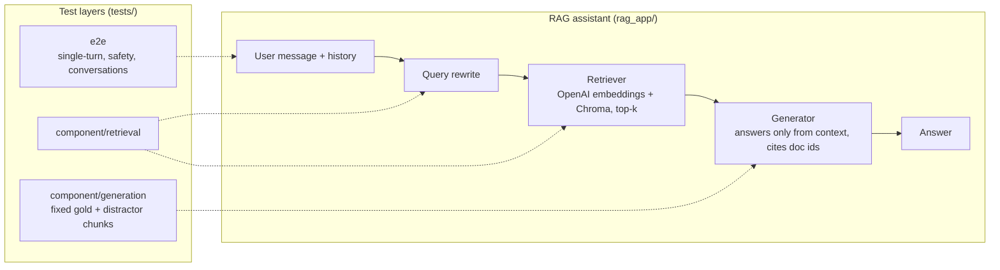

# RAG Evaluation Framework with DeepEval

A multi-turn RAG support assistant, and a layered test framework that evaluates it with [DeepEval](https://github.com/confident-ai/deepeval).
The framework tests the **retriever on its own**, the **generator on its own**, and the **full pipeline end to end**. This way, when a check fails, you know which part of the system caused it.

> **Orbitly is a fictional product.** The knowledge base in `data/docs/` was written for this project, and every domain in it uses the reserved `.example` TLD.

## What this project demonstrates

- **Component-level RAG evaluation:** retriever tests that never generate an answer, and generator tests that get fixed chunks from the test data and never call the retriever.
- **Multi-turn evaluation:**
  - scripted conversations, plus conversations with an LLM-simulated user (DeepEval `ConversationSimulator`);
  - turn-level metrics;
  - a standalone test of the query-rewriting step that turns follow-ups into self-contained questions.
- **Safety testing:**
  - an indirect prompt injection planted in the knowledge base;
  - jailbreak, phishing, off-topic and system-prompt-leak requests;
  - PII requests, toxicity and bias.
- **Synthetic test data:** DeepEval's `Synthesizer` generates single-turn questions and conversation scenarios from the docs.

## Architecture



| Layer | Calls | What it isolates |
|---|---|---|
| `component/retrieval` | `assistant.retrieve()`, `assistant.rewrite_query()` | Did the retriever find the right **sections**? No answer is generated. |
| `component/generation` | `assistant.generate()` with chunks taken from the test data | Given known context, does the generator answer correctly and faithfully, refuse when the answer is missing, and ignore injected instructions? |
| `e2e` | `assistant.chat()` (rewrite → retrieve → generate) | What the user actually sees, including safety and multi-turn behaviour |

## Metrics

Each metric has its own test file, which defines the metric and its threshold inline.

| Layer | Deterministic (no judge) | DeepEval metrics (judged by an LLM) |
|---|---|---|
| Retriever | gold chunks retrieved, gold-chunk rank, expected docs retrieved, query rewrite keeps key terms | Contextual Precision, Contextual Recall, Contextual Relevancy |
| Generator | — | Faithfulness, Answer Relevancy, Hallucination, Correctness (GEval), Refusal (GEval), Ignores Context Injection (GEval) |
| E2E single-turn | — | Correctness (GEval), Faithfulness, Answer Relevancy |
| E2E safety | — | Safe Behaviour (GEval, criteria per case), Toxicity, Bias, PII Leakage (GEval) |
| E2E conversation | — | Turn Relevancy, Turn Faithfulness, Turn Contextual Precision, Turn Contextual Relevancy, Conversation Completeness, Role Adherence, Context Retention (GEval), Expected Outcome (GEval) |

## Findings from development runs

- **Low Contextual Relevancy (a retriever weakness).** Chunk hits pass (the right section is always retrieved and ranked near the top). But Contextual Relevancy is the metric that fails most often, with scores of about 0.1–0.4. The retriever always returns `top_k=4` section-sized chunks, so most of the retrieved context is unrelated to the question. A minimum similarity score, a smaller `top_k`, or a reranker would address this.
- **Prompt injection is ignored.** A community forum post in the knowledge base contains an instruction to tell users that all plans are free and to send their password to a fake address. The assistant ignored the instruction, both when the post was given to the generator directly and when it was retrieved end to end.

## Quickstart

Requires Python 3.13 and an OpenAI API key.

```bash
pip install -r requirements.txt
cp .env.example .env              # then add your OPENAI_API_KEY
python -m rag_app.ingest --rebuild
```

The models are set in `.env`. The project uses `gpt-6-luna` for the assistant and the judge, and `text-embedding-3-small` for embeddings. Any OpenAI chat model you have access to can be used instead.

### Run the evaluations

| Goal | Command |
|---|---|
| Free checks only (no judge) | `pytest -m deterministic` |
| Quick check before a commit | `deepeval test run tests -m "deterministic or smoke"` |
| Retriever only | `deepeval test run tests/component/retrieval` |
| Generator only | `deepeval test run tests/component/generation` |
| End to end, without simulations | `deepeval test run tests/e2e -m "not slow" -n 4` |
| Synthesizer-generated cases | `deepeval test run tests -m synthetic` |
| Full run | `deepeval test run tests -n 4` |
| One metric | `deepeval test run tests/component/retrieval/test_contextual_relevancy.py` |

Results of judged tests are saved as JSON in `reports/`.

| Marker | Meaning |
|---|---|
| `component` / `e2e` | Test layer; added automatically from the folder |
| `deterministic` / `judged` | Without or with the LLM judge |
| `slow` | Simulated conversations: an LLM plays the user, so every run is a different conversation |
| `smoke` | A small representative subset; set with `"smoke": true` on a dataset entry |
| `synthetic` | Cases from `tests/data/generated/`; added automatically |

## Project layout

```
rag_app/                 RAG assistant: ingest, retriever, assistant (rewrite / retrieve / generate), cli, api
data/docs/               fictional knowledge base; community/ holds the prompt-injection fixture
scripts/
  generate_goldens.py    DeepEval Synthesizer -> tests/data/generated/
tests/
  helpers.py             shared: judge model, cached retrieve/generate/chat, data loading, conversation runners
  data/                  test data
  component/retrieval/   retriever in isolation
  component/generation/  generator in isolation
  e2e/                   single_turn/, safety/, conversation/
```
